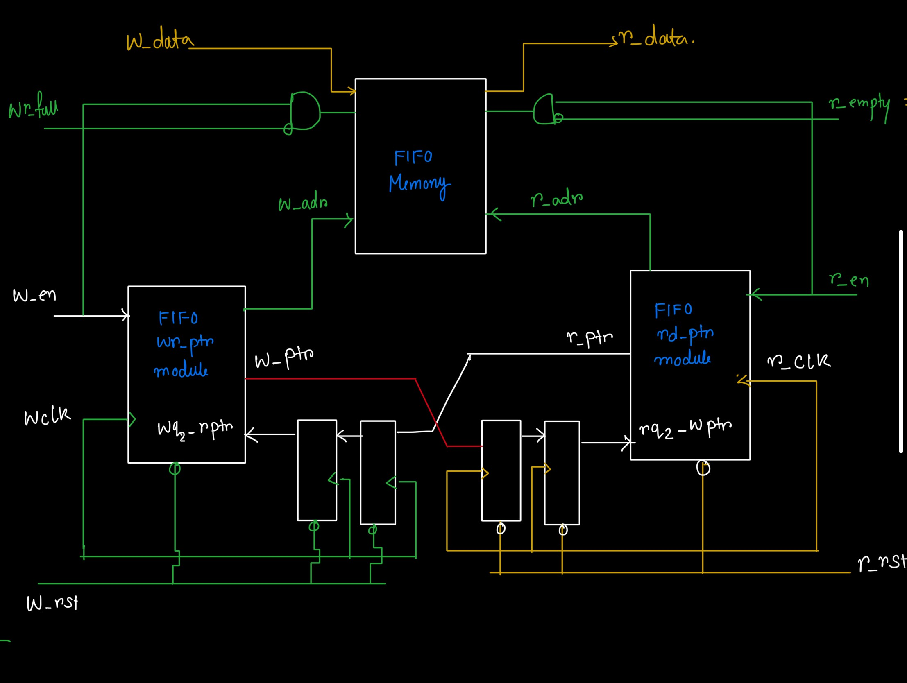

# Asynchronous FIFO Design in Verilog

## 📚 **Overview**
This project implements an **Asynchronous FIFO (First-In-First-Out) buffer** using **Verilog HDL**, suitable for crossing data between two asynchronous clock domains. The FIFO ensures reliable data transfer by using synchronizers and Gray-coded pointers to avoid metastability and timing issues. 

As one example I can give here like suppose a temporary storage element is one side, from another side if I want to comunicate between two of them then for to communicate use one FIFO. Because it is the data communication between two different clock domain. There the ethernet controller writes the data in faster clock spped in FIFO memory and that system memory reads the data form FIFO memory compared to slow clock speed.

---

## 🚀 **Key Features**
- **Asynchronous Clocks:** Independent write and read clock domains. 
- **2-Stage Synchronizer & binary to gray & gray to binary :** Reduces metastability in pointer transfer, For safe synchronization across clock domains.
- **Full and Empty Flags:** Accurate detection of FIFO status.
- **Configurable Parameters:** Supports parameterized data width, depth, and address size.
- **Testbench Included:** Basic testbench for functional simulation with independent clocks.

---

## 🖼️ **Asynchronus FIFO TOP RTL design block wise**




## 🛠️ **Modules Breakdown**

### 1️⃣ **`two_ff_sync`** - 2-Stage Synchronizer
- Synchronizes pointers between clock domains.
- Handles metastability by passing the signal through two flip-flop stages.

### 2️⃣ **`write_pointer`**
- Increments on each write operation.
- Outputs both binary and Gray-coded values for synchronization.

### 3️⃣ **`read_pointer`**
- Increments on each read operation.
- Outputs both binary and Gray-coded values for synchronization.

### 4️⃣ **`fifo_memory`**
- Dual-port RAM for storage.
- Separate read and write addresses.

### 5️⃣ **`status_flags`**
- Generates **FIFO Full** and **FIFO Empty** flags based on synchronized pointers.

### 6️⃣ **`async_fifo`** (Top-Level Module)
- Integrates all modules.
- Handles write/read operations, pointer synchronization, and status flag generation.

### 7️⃣ **`async_fifo_tb`** (Testbench)
- Generates asynchronous write and read clocks.
- Tests basic FIFO operations: write, read, full, and empty detection.
- Displays output on simulation waveform.

---

## 📝 **Usage Instructions**

### 💻 **Prerequisites:**
- **Xilinx Vivado** or any Verilog-compatible simulator (ModelSim, Synopsys VCS, etc.)

### ⚡ **Simulating in Vivado:**
1. Clone this repository:
   ```bash
   git clone https://github.com/yourusername/async-fifo-verilog.git
   cd async-fifo-verilog
   ```
2. Open Vivado and create a new project.
3. Add all Verilog source files (`*.v`) and the testbench file.
4. Set `async_fifo_tb` as the top module for simulation.
5. Run Behavioral Simulation:  
   **Flow Navigator** → **Simulation** → **Run Simulation** → **Run Behavioral Simulation**

### 🏃 **Expected Simulation Results:**
- **Write Phase:** `data_in` increments on `wr_clk` rising edges.
- **Read Phase:** `data_out` reflects written data in the exact order.
- **FIFO Flags:**
  - `fifo_full` remains low unless capacity is reached.
  - `fifo_empty` asserts after all data is read.

---

## 🔍 **Waveform Verification Checklist**
- ✅ **Data Consistency:** `data_out` matches `data_in` order (FIFO behavior).
- ✅ **Pointer Synchronization:** Pointers cross clock domains without glitches.
- ✅ **Full/Empty Flags:** Trigger correctly during respective conditions.
- ✅ **Latency Measurement:** Delay between write and read shows expected asynchronous behavior.

🎯 **Contributing**
Pull requests are welcome. For major changes, please open an issue first to discuss what you would like to change.

---

## 🌟 **Acknowledgments**
- Concepts inspired by standard asynchronous FIFO design techniques.
- Developed as part of a digital design project using Xilinx tools.

---

⭐ **_If you find this project helpful, feel free to star the repo and share your feedback!_** ⭐
